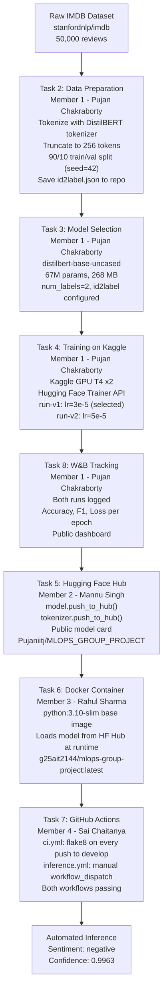
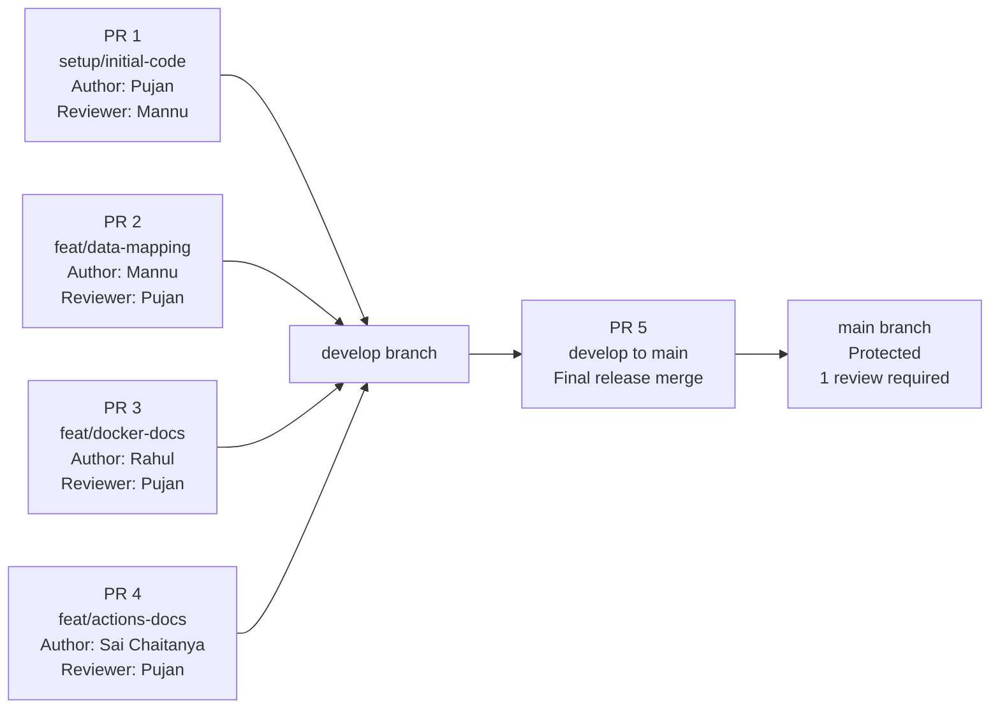

# End-to-End MLOps Pipeline — Sentiment Analysis on IMDB

**IIT Jodhpur | PGD AI Program | MLOps (CSL7040) | Group 8**

---

## Team Members

| Member | Full Name | Roll No | GitHub Username | Tasks |
|---|---|---|---|---|
| Member 1 (Admin) | Pujan Chakraborty | G25AIT2076 | pujaniitj | Tasks 1, 2, 3, 4, 8 |
| Member 2 | Mannu Singh | [TO BE ADDED] | manuiitj | Task 5 |
| Member 3 | Rahul Sharma | G25AIT2144 | g25ait2144 | Task 6 |
| Member 4 | Sai Chaitanya | [TO BE ADDED] | g25ait2143-spec | Task 7 |

---

## Live Project Links

All links are publicly accessible.

| Resource | URL |
|---|---|
| GitHub Repository | https://github.com/pujaniitj/mlops-group-project-iitj |
| Hugging Face Model | https://huggingface.co/Pujaniitj/MLOPS_GROUP_PROJECT |
| Docker Hub Image | https://hub.docker.com/r/g25ait2144/mlops-group-project |
| W&B Dashboard | https://wandb.ai/pujaniitj-iit-jodpur/MLops_group_8 |
| Kaggle Notebook V1 | https://www.kaggle.com/code/pujaniitj/mlops-group-8-imdb-v1 |
| Kaggle Notebook V2 | https://www.kaggle.com/code/pujaniitj/mlops-group-8-imdb-v2 |

---

## Project Overview

This project demonstrates a complete end-to-end MLOps pipeline for binary sentiment classification on IMDB movie reviews. The pipeline covers every stage from raw data ingestion and model fine-tuning, through experiment tracking, to containerized inference and automated CI/CD workflows via GitHub Actions.

| Property | Value |
|---|---|
| Task | Binary Sentiment Classification (Positive / Negative) |
| Dataset | stanfordnlp/imdb — 50,000 reviews from Hugging Face Hub |
| Base Model | distilbert-base-uncased (67M parameters, 268 MB) |
| Production Model | run-v1 (learning rate = 3e-5) |
| Training Platform | Kaggle Notebooks (NVIDIA Tesla T4 x2 GPU) |
| Experiment Tracking | Weights and Biases — project: MLops_group_8 |

---

## Pipeline Architecture



---

## Pull Request Workflow

The following diagram shows the branching strategy and pull request flow used throughout the project. All work was done on short-lived feature branches that merged into `develop`, with a final merge from `develop` to `main` for release.



### Pull Request History

| PR | Branch | Author | Reviewer | Description |
|---|---|---|---|---|
| PR 1 | setup/initial-code to develop | Pujan Chakraborty | Mannu Singh | Initial code scaffold — data prep, train skeleton |
| PR 2 | feat/data-mapping to develop | Mannu Singh | Pujan Chakraborty | IMDB label mapping, Dataset README section |
| PR 3 | feat/docker-docs to develop | Rahul Sharma | Pujan Chakraborty | Docker Hub documentation in README |
| PR 4 | feat/actions-docs to develop | Sai Chaitanya | Pujan Chakraborty | GitHub Actions documentation in README |
| PR 5 | develop to main | Pujan Chakraborty | Admin bypass | Final merge — all tasks complete |

---

## Repository Structure

```
mlops-group-project-iitj/
|
|-- .github/
|   |-- workflows/
|       |-- ci.yml                    CI lint check on every push to develop
|       |-- inference.yml             Manual inference via workflow_dispatch
|
|-- src/
|   |-- data_prep.py                  Data cleaning and tokenization (Task 2)
|   |-- train.py                      Model loading skeleton (Task 3)
|   |-- inference.py                  Inference script for Docker and GitHub Actions
|   |-- push_to_hub.py                Hugging Face model push script (Task 5)
|
|-- data/
|   |-- id2label.json                 Label mapping committed to repository
|
|-- notebooks/
|   |-- kaggle_training_v1.ipynb      Training notebook V1 (lr=3e-5)
|   |-- kaggle_training_v2.ipynb      Training notebook V2 (lr=5e-5)
|
|-- Dockerfile                        Container definition for inference
|-- .dockerignore                     Docker build exclusions
|-- requirements.txt                  Python dependencies
|-- .gitignore                        Git exclusions
|-- LICENSE                           MIT License
|-- README.md                         This file
```

No API tokens are hardcoded anywhere in the repository. All secrets are stored in GitHub Secrets (`HF_TOKEN`, `WANDB_API_KEY`) and Kaggle Secrets.

---

## Task 1 — GitHub Repository Setup

**Completed by: Member 1 — Pujan Chakraborty**

| Setup Item | Detail |
|---|---|
| Repository | Public — mlops-group-project-iitj — README.md, .gitignore, MIT LICENSE |
| Branches | develop (active work) — main (protected, 1 PR review required before merge) |
| Collaborators | Member 1 = Admin — Members 2, 3, 4 = Collaborators with Write access |
| GitHub Secrets | HF_TOKEN (write access to HF Hub) — WANDB_API_KEY (experiment tracking) |

### Branch Strategy

```
Feature branches  -->  develop  (via Pull Request with 1 review)
                            |
                          main   (via Pull Request — final release only)
```

All members commit to feature branches. Feature branches merge into develop via Pull Requests. Only develop to main merges are permitted after review. Direct pushes to main are blocked.

---

## Task 2 — Data Preparation and Normalisation

**Completed by: Member 1 — Pujan Chakraborty**

| Property | Value |
|---|---|
| Dataset | IMDB Movie Reviews — load_dataset("stanfordnlp/imdb") |
| Train size | 25,000 reviews (12,500 positive + 12,500 negative — perfectly balanced) |
| Test size | 25,000 reviews (same class distribution) |
| Text length | Min: 10 words — Max: 2,470 words — Mean: 234 words — 95th percentile: 598 words |
| Missing values | None |
| Duplicate reviews | 96 out of 25,000 (0.38%) — negligible, not removed |

### Cleaning Decisions

| Decision | Justification |
|---|---|
| Truncation to 256 tokens | DistilBERT supports 512 tokens, but 256 covers the median review length (174 words) and allows larger batch sizes on the T4 GPU |
| Fixed-length padding | Uniform batch shapes are required by the PyTorch DataLoader |
| No manual lowercasing | The distilbert-base-uncased tokenizer handles casing internally |
| 90/10 train/validation split | seed=42 for reproducibility. Validation set is used for load_best_model_at_end=True |
| No class resampling | The dataset is perfectly balanced — 12,500 samples per class per split |
| Label mapping | {0: negative, 1: positive} saved as data/id2label.json and committed to the repository |

---

## Task 3 — Model Selection and Loading

**Completed by: Member 1 — Pujan Chakraborty**

| Property | Value |
|---|---|
| Model | distilbert-base-uncased |
| Hugging Face URL | https://huggingface.co/distilbert-base-uncased |
| Parameters | Approximately 67 million (40% smaller than BERT-base at 110M) |
| Size on disk | 268 MB |
| Pre-training data | BookCorpus and English Wikipedia (uncased) |
| Loading method | AutoTokenizer and AutoModelForSequenceClassification with num_labels=2 |

### Model Selection Rationale

DistilBERT was selected based on four factors from its Hugging Face model card. First, it retains 97% of BERT's language understanding while being 40% smaller and 60% faster, making it well suited for Kaggle's free GPU tier. Second, at 268 MB it trains within the T4 GPU memory quota without requiring dataset down-sampling. Third, pre-training on BookCorpus and English Wikipedia provides strong representations that transfer well to the informal review-style language of IMDB data. Fourth, the uncased variant reduces vocabulary size and improves robustness to capitalisation differences in user-generated text. Bidirectional attention allows the model to consider the full sentence context when classifying sentiment, a critical advantage over unidirectional alternatives for this task.

---

## Task 4 — Training on Kaggle and W&B Tracking

**Completed by: Member 1 — Pujan Chakraborty**

| Property | Detail |
|---|---|
| Platform | Kaggle Notebooks (GPU T4 x2) — Hugging Face Trainer API |
| Secrets management | WANDB_API_KEY and HF_TOKEN loaded from Kaggle Secrets — never hardcoded |
| W&B Project | MLops_group_8 (Public) |
| W&B Dashboard | https://wandb.ai/pujaniitj-iit-jodpur/MLops_group_8 |
| Kaggle Notebook V1 | https://www.kaggle.com/code/pujaniitj/mlops-group-8-imdb-v1 |
| Kaggle Notebook V2 | https://www.kaggle.com/code/pujaniitj/mlops-group-8-imdb-v2 |

### Hyperparameter Comparison

| Metric / Hyperparameter | run-v1 (selected) | run-v2 |
|---|---|---|
| Learning Rate | 3e-5 | 5e-5 |
| Epochs | 3 | 3 |
| Batch Size | 16 | 16 |
| Max Token Length | 256 | 256 |
| Eval Accuracy | 0.9112 | 0.9068 |
| Eval F1 Score | 0.9112 | 0.9068 |
| Eval Loss | 0.7224 (lower) | 0.8662 |
| Training Runtime | 17m 16s | 18m 50s |

### Why run-v1 Was Selected

run-v1 outperformed run-v2 on every key metric. It achieved higher evaluation accuracy and F1 score (0.9112 vs 0.9068), and significantly lower evaluation loss (0.7224 vs 0.8662), indicating better calibration and fewer confident wrong predictions. run-v1 also trained faster (17m 16s vs 18m 50s). The lower learning rate of 3e-5 produced a more stable training trajectory while reaching a better local minimum. Combined with the lower loss and faster training, run-v1 is the clear production choice.

---

## Task 5 — Push Model to Hugging Face Hub

**Completed by: Member 2 — Mannu Singh**

| Property | Value |
|---|---|
| Hugging Face URL | https://huggingface.co/Pujaniitj/MLOPS_GROUP_PROJECT |
| Visibility | Public — no authentication required |
| Model pushed | run-v1 (selected production model) |
| Contents | Model weights (268 MB) + tokenizer + model card |
| Script | src/push_to_hub.py committed to repository |

The model card documents the base model architecture, training procedure, evaluation results, intended use cases, and known limitations including domain shift, sarcasm handling, and non-English text.

---

## Task 6 — Docker Container

**Completed by: Member 3 — Rahul Sharma**

| Property | Value |
|---|---|
| Docker Hub URL | https://hub.docker.com/r/g25ait2144/mlops-group-project |
| Image tag | g25ait2144/mlops-group-project:latest |
| Visibility | Public — anyone can pull |
| Base image | python:3.10-slim |
| Image size | 2.7 GB |

### Dockerfile

```dockerfile
FROM python:3.10-slim

WORKDIR /app

ARG HF_MODEL_NAME=pujaniitj/MLOPS_GROUP_PROJECT
ENV HF_MODEL_NAME=${HF_MODEL_NAME}

RUN pip install --no-cache-dir \
    transformers \
    torch --index-url https://download.pytorch.org/whl/cpu \
    huggingface_hub

COPY src/ ./src/

CMD ["python", "src/inference.py"]
```

### Usage

Pull and run with default text:

```bash
docker pull g25ait2144/mlops-group-project:latest
docker run --rm g25ait2144/mlops-group-project:latest
```

Run with custom input:

```bash
docker run --rm \
  -e INPUT_TEXT="This movie was absolutely fantastic!" \
  g25ait2144/mlops-group-project:latest
```

Build locally:

```bash
git clone https://github.com/pujaniitj/mlops-group-project-iitj.git
cd mlops-group-project-iitj
docker build -t mlops-group-project:latest .
docker run --rm -e INPUT_TEXT="Your text here" mlops-group-project:latest
```

### Sample Output

```
Model: pujaniitj/MLOPS_GROUP_PROJECT
Input: Worst film I have ever watched.
Loading model from Hugging Face Hub...
Running inference...

========================================
  Sentiment:  negative
  Confidence: 0.9963
========================================
```

### Design Decisions

| Decision | Justification |
|---|---|
| python:3.10-slim | Minimal runtime image — reduces image size and pull time |
| ARG HF_MODEL_NAME with default | Model name configurable at build time — reusable with any Hugging Face model |
| ENV HF_MODEL_NAME | Propagates build argument to runtime so inference.py reads via os.environ.get() |
| CPU-only torch | Reduces image from approximately 8 GB (GPU) to 2.7 GB. Inference does not require GPU |
| No-cache-dir flag | Keeps final image minimal by discarding pip cache |
| Model loaded at runtime | Model weights are not bundled in the image — downloaded from Hugging Face Hub on each run |

---

## Task 7 — GitHub Actions CI/CD

**Completed by: Member 4 — Sai Chaitanya**

| File | Trigger | Purpose | Status |
|---|---|---|---|
| .github/workflows/ci.yml | Every push or PR to develop | Lint with flake8 | Passing |
| .github/workflows/inference.yml | Manual (workflow_dispatch) | Run sentiment inference | Passing |

### CI Workflow

Triggers automatically on every push or pull request to the develop branch.

Steps executed:
- Check out code
- Set up Python 3.10
- Install flake8
- Run flake8 on src/ with max line length 120
- Fail the build if any critical code errors are found

CI status badge:


### Inference Workflow

Triggered manually via the GitHub Actions UI using workflow_dispatch. Accepts custom text input and runs the DistilBERT sentiment classifier.

To trigger manually:

1. Go to the Actions tab in the GitHub repository
2. Click Inference - Run Sentiment Analysis in the left sidebar
3. Click Run workflow
4. Enter the text to classify
5. Click the green Run workflow button
6. Wait approximately one minute for the result

Sample output from a confirmed run:

```
Model: pujaniitj/MLOPS_GROUP_PROJECT
Input: Worst film I have ever watched
Loading model from Hugging Face Hub...
Running inference...

========================================
  Sentiment:  negative
  Confidence: 0.9963
========================================
```

---

## Task 8 — W&B Experiment Dashboard

**Completed by: Member 1 — Pujan Chakraborty**

| Property | Value |
|---|---|
| W&B Project | MLops_group_8 |
| Dashboard URL | https://wandb.ai/pujaniitj-iit-jodpur/MLops_group_8 |
| Visibility | Public |
| Runs | run-v1 (0.9112 accuracy) and run-v2 (0.9068 accuracy) — both visible with full metrics |

Both training runs are visible in the W&B dashboard with overlaid loss curves, accuracy and F1 curves per epoch, a full runs comparison table, and all hyperparameters logged via wandb.config.

---

## Member Contributions

| Member | GitHub Contributions |
|---|---|
| Pujan Chakraborty | Repository admin, initial scaffold (PR 1), data_prep.py, train.py, requirements.txt, Kaggle training notebooks V1 and V2, id2label.json, inference.py, push_to_hub.py |
| Mannu Singh | PR 1 reviewer and approver, model push to Hugging Face Hub, model card, PR 2 author (label mapping) |
| Rahul Sharma | Dockerfile, .dockerignore, Docker Hub push and overview documentation, Docker README section (PR 3) |
| Sai Chaitanya | ci.yml, inference.yml, GitHub Actions README section (PR 4) |

---

## Setup and Installation

Clone the repository:

```bash
git clone https://github.com/pujaniitj/mlops-group-project-iitj.git
cd mlops-group-project-iitj
```

Install dependencies:

```bash
pip install -r requirements.txt
```

Run inference locally:

```bash
python src/inference.py "This movie was absolutely fantastic!"
```

Run via Docker:

```bash
docker pull g25ait2144/mlops-group-project:latest
docker run --rm -e INPUT_TEXT="This movie was fantastic!" g25ait2144/mlops-group-project:latest
```

---

## Libraries Used

| Library | Version | Purpose |
|---|---|---|
| transformers | latest | DistilBERT model, tokenizer, Trainer API |
| datasets | latest | IMDB dataset loading from Hugging Face Hub |
| torch | 2.0.0 or higher (CPU) | PyTorch inference backend |
| wandb | 0.16.0 or higher | Experiment tracking and visualization |
| huggingface_hub | 0.24.0 or higher | Model push to Hugging Face Hub |
| scikit-learn | 1.3.0 or higher | Accuracy, F1, precision, recall metrics |
| flake8 | latest | Code linting in CI workflow |
| accelerate | latest | Mixed precision training (fp16) |

---

## License

This project is licensed under the MIT License. See the LICENSE file for details.
